# 计算机视觉期末项目总结报告

| 成员   | 孙延都、王茜    |
| :--- | :-------- |
| 指导教师 | 亓琳        |
| 日期   | 2024.6.21 |

[TOC]

# 1. 绪论 Introduction

​	由于传感器动态范围的限制，在宽亮度范围场景下，单次曝光难以同时捕捉亮部和暗部细节。因此，采用多曝光图像融合的方式来获得HDR图像。然而，由于相机抖动和物体运动，多曝光图像可能存在错位，导致融合结果出现鬼影伪影。传统方法通过排除错位区域、图像对齐和基于块的合成来去除鬼影。近年来，深度学习方法被提出用于数据驱动的去鬼影，但需要大量的带标签的训练数据，这些数据的收集和标注成本高昂且耗时，限制了数据集的数量和多样性。

​	在“SELF-SUPERVISED HIGH DYNAMIC RANGE IMAGING WITH MULTI-EXPOSURE IMAGES IN DYNAMIC SCENES“”（在动态场景中使用多重曝光图像进行自监督高动态范围成像）一文中提出了SelfHDR方法，通过自监督学习，避免了这一需求。

​	其通过学习重建网络从多重曝光图像中获取HDR图像，无需使用真实的HDR标记数据。SelfHDR将潜在HDR图像分解为颜色和结构两个互补组件，并利用这两个组件来监督重建网络的学习。具体来说，颜色组件通过对齐的多重曝光图像进行估计，而结构组件则通过一个以结构为中心的网络生成，该网络受到颜色组件和输入参考图像的监督。在测试阶段，仅使用重建网络来预测HDR图像。该文章在多个数据集上评估了SelfHDR的性能，并与现有方法进行了比较。实验结果表明，SelfHDR在重建HDR图像方面优于现有的自监督方法，并且与监督方法的效果相当。特别是在视觉效果方面，SelfHDR与监督方法表现相似。（实验结果表明，SelfHDR在现实世界图像上取得了优异的效果，与监督方法具有可比性。）此外，作者还进行了广泛而全面的消融研究，分析不同成分和变体的有效性。

​	虽然SelfHDR方法已经在自监督HDR重建方面取得了显著成果，但仍存在提升空间。故本实验参考该论文提出的方法，在现有的SelfHDR自监督HDR重建方法的基础上，尝试通过改进算法细节和优化操作流程，尝试进一步提高重建质量，减少计算成本，提升HDR图像重建的准确率和效率，以实现更高效的操作。

​	在本实验中，我们将通过图像对齐方法的改进、优化器的调整、损失函数的优化以及学习率的考虑来进一步探索和优化SelfHDR方法，以实现更高质量的HDR图像重建。

# 2.  相关工作 Related Work

​	在多重曝光HDR成像领域，目前的难点主要集中在解决鬼影伪影问题、细节信息丢失的问题。Kalanrati等人收集真实世界的数据集，并首次提出使用卷积神经网络（CNN）进行动态场景的高动态范围（HDR）成像，他们的研究显示，通过训练CNN来处理不同曝光的图像，可以有效地生成高质量的HDR图像，特别是在处理动态场景时，这种方法可以产生比传统方法更好的结果。Wu et al.（2018）的研究工作涉及了利用光流对齐技术来处理多帧图像的对齐和重构，特别是在动态场景中。他们的工作展示了如何通过光流法实现多帧图像的对齐，并进一步通过深度学习技术生成HDR图像。这种方法有助于解决由相机抖动和物体运动引起的图像错位问题，从而减少鬼影伪影的产生。

​	Jun Xing等人提出的用于图学习的多重曝光嵌入：迈向高动态范围图像显着性预测的工作涉及使用图神经网络来建模多重曝光图像和色调映射图像之间的关系，从而实现更具辨别力的显着性相关特征表示。Yan Qingsen等人提出的FSHDR方法的主要研究了开发一种能够在较少样本的情况下学习并有效地去除HDR图像中的鬼影。这一方法对于减少在HDR成像过程中由相机抖动和物体运动引起的鬼影伪影具有重要意义。Jing Gan等人进行的基于反馈网络的无重影多重曝光高动态范围成像的研究提出了一种新的深度学习算法，用于实现无鬼影多重曝光HDR成像。该方法首次将反馈机制应用于多重曝光HDR成像，通过注意力引导编码器和特征合并网络来调整和融合图像特征，以提高HDR图像重建的质量和性能。这些方法为我们尝试创新的自监督学习提供了一个新的视角。我们可以考虑如何将这些方法与我们的自监督学习框架相结合，以进一步提高HDR图像重建的质量和性能。

​	此外，目前已有一些自监督学习方法在图像处理领域取得了进展。例如，单图像HDR重建方法是使用具有掩码特征和感知损失的CNN进行单图像HDR重建。这种方法通过恢复输入LDR图像的饱和像素来重建HDR图像，旨在以视觉上令人愉悦的方式扩展图像的亮度范围。这种方法可以为我们改进SelfHDR提供新的思路。

# 3.  方法approach

## 3.1 实验方法

### **3.1.1  Supervised HDR Reconstruction：**

1.  多曝光图像的组合使在场景中的HDR成像具有更广泛的亮度水平（也就是更加真实）。

    1.  在静态场景中，HDR图像可以通过对多曝光图像的加权求和来获得。

    2.  在动态场景中，直接加权求和就会产生伪影。（因为场景在变化，不同曝光图像中物体位置可能会变化）

2.  使用有监督的深度学习网络去除伪影。

    1.  首先将LDR图像映射到一个线性空间，Ii是曝光时间为ti的LDR图像，t1\<t2\<t3。γ是伽马矫正参数，一般设置为2.2。
        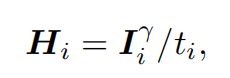
    
    2.  然后把Ii和Hi联系起来，记作Xi，把他们和参数θ一起输入到重建网络R，得到预测值。
        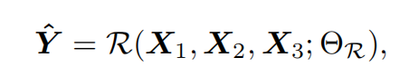

    3.  参数θ通过下式进行优化。通过最小化真实HDR图像和重建的HDR图像之间的LOSS。
        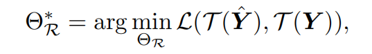
    
    4.  τ是个tone-mapping过程，公式如下：
        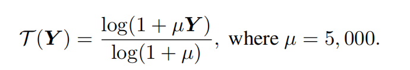

### **3.1.2  Motivation of SelfHDR**

1.  为HDR重建获取标记好的数据是很难的，所以要**减少对HDR真实数据的依赖**。有些工作使用**构建伪图像对**的方法，但是由于其与真实数据的差异，最后的表现不让人满意，尤其是在完全自监督的情况下。

2.  作者希望**摆脱对伪图像对的依赖**，利用真实世界的动态多曝光图像直接实现自监督的HDR重建。多曝光图像包含着充足的信息，当分别从**颜色和结构**两个方面来看时更加明显。

    1.  一方面，HDR图像的颜色可以**从对齐输入的LDR图像来估计**。

    2.  另一方面，HDR图像的结构信息通常可以在一些多曝光图像中被发现，**大多数纹理存在于中曝光的图像中**，**黑暗的细节在高曝光图像中更明显**，**而明亮的场景在低曝光图像中更明显**。

3.  所以我们需要做的是从**多曝光图像中挖掘正确的信息来构建HDR图像**。

4.  考虑到上述HDR颜色和结构的特性，\*\*分别处理这两个组件，\*\*以便于自监督实现。（它可以是相对地更加关注其中某一个组件，而不一定是绝对的分离。）

5.  具体来说，当以给定的多曝光图像作为输入，训练一个自监督的HDR重建网络时，必须**准备合适的监督信号**。分别构建了监督颜色和结构的组件，然后，我们在这两个组件的指导下学习网络。

### **3.1.3  CONSTRUCTING COLOR AND STRUCTURE COMPONENTS**

1.  构建颜色组件：

    1.  应尽可能的表示HDR图像的颜色，通过融**合对齐的多曝光图像来估计**。

    2.  第一步，如何对齐图像：

        1.  鉴于光流估计方法的能力，**首先执行预对齐**操作。以中等曝光图像I2为参考，分别计算从I2到I1和I3的光流。通过计算得到的光流扭曲H1和H3，使其大致与H2对齐。

        2.  然后利用下式预测颜色成分，Ai代表像素级别的融合权重。（可以看出，因为高曝光图像H3中黑暗的细节更明显，故在融合时，权重A3在较暗的像素上更大，从而更多地保留了黑暗中细节的颜色，其他同理）
            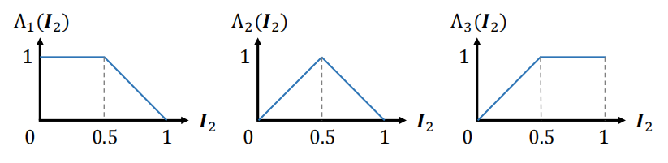
            
        3.  当图像完全对齐时，颜色分量Ycolor可以直接视为HDR图像，但是肯定不是完全对齐的（光流预测的有误差等等），预对齐过程中的小错误可能会导致模糊，而大的错误可能会导致重影。但是**没有重影的地方可以记录HDR图像粗略的颜色值**，**其中对齐良好的区域可以为HDR图像提供良好的颜色和结构线索**。
        
        4.  对于有对齐误差的区域，我们进一步构造结构组件来指导重建网络。
    
2.  构建结构组件：
    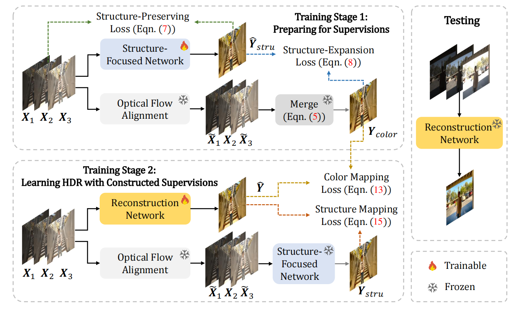
    
    1. 虽然中曝光图像可以提供大部分的纹理信息，但是只使用其作为结构指导不是最优的，因为可能会存在不清楚的黑暗区域和过度曝光的区域；同时，由于HDR图像与低曝光和高曝光图像之间的位置和颜色差异，使用低曝光和高曝光图像作为指导是不实际的。
    
    2. 但是颜色组件Ycolor在一定程度上保留了黑暗和过度暴露区域的结构。因此，我们可以结合中曝光图像和颜色组件Ycolor来帮助构建结构组件。
    
    3.  我们首先在中曝光图像和颜色组件Ycolor的指导下学习一个**聚焦结构的网络**。一方面，中曝光图像引导网络从输入的参考图像（中曝光图像）中保存曝光良好的纹理。它是通过一个结构保留损失Lsp来完成的，它可以写成下式：（通过最小化该损失优化聚焦结构的网络，可以最大程度的保留参考图像中曝光良好区域的纹理信息）
        
    
    4.  Ystru是网络输出，Msp是一个强调良好曝光区域的mask，可以减轻了参考图像H2中黑暗和过度暴露的区域的不良影响。将其设置为下式：
        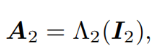
    
    5. 另一方面，颜色组件Ycolor通过计算结构扩展损失Lse来引导网络**从非参考图像中学习结构**，它可以写成：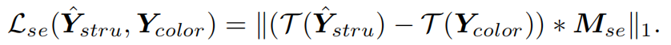
    
    6.  Mse是一个二进制mask，区分Ycolor的像素是否由对齐的多曝光像素组成。mask中像素定义为：
        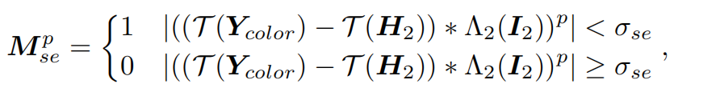
    
        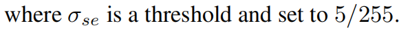
        
    7.  我们的理解是，因为Ycolor中在一定程度上保留了黑暗和过度暴露区域的结构，最小化Lse损失可以优化该网络，使其更多的保留黑暗和过度暴露区域的结构。
        
    8.  所以聚焦结构的网络的参数由这两个损失共同优化，**可以最大程度的保留输入多曝光图像中的所有结构信息**。
        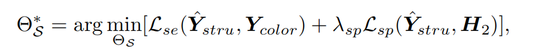
    
    9.  然后，我们将**对齐的多曝光图像**输入预先训练的结构聚焦网络S。最终的结构组件Ystru可以表示为:
        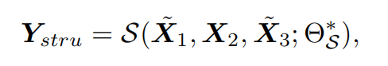
    
    10. 这种操作可以帮助网络S减**少对齐负担**，此外，得益于Ycolor的监督，结构组件Ystru**也有一些颜色线索**。

### **3.1.4  LEARNING HDR WITH COLOR AND STRUCTURE COMPONENTS**

1.  以颜色和结构组件为指导，我们可以训练一个HDR重建网络R，其参数θR通过下式优化：
    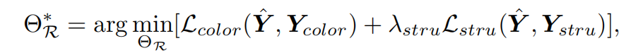

2.  对于颜色损失项，Mcolor也是一个二进制mask，它排除了光流估计错误的区域。
    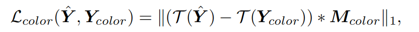
    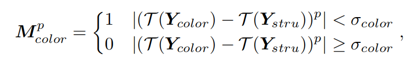

    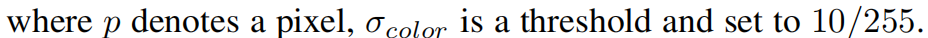
    
3.  对于结构损失项，使用了基于VGG的感知损失。
    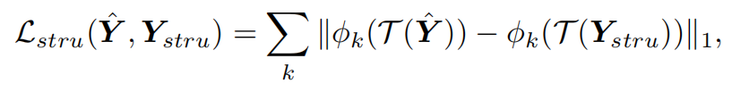
    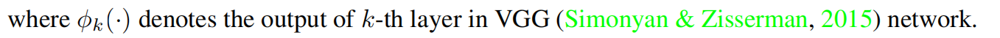

## **3.2 优化方法：**

### **3.2.1 优化器调整：**

原论文中使用的优化器是Adam，尝试将其改为SGD，以提高在大规模数据集上的效率。

### **3.2.2  损失函数优化**

原论文中使用的损失函数是L1MuLoss，尝试使用别的损失函数来替代。

### **3.2.3 学习率考虑**

为了提高训练效率和模型性能，尝试添加了学习率衰减函数，以动态调整学习率。

### **3.2.4 图像对齐优化**

原论文中使用光流估计方法进行图像对齐，我尝试改进权重计算方法，考虑更多因素，如图像梯度、亮度差异等，以更准确地反映像素级的融合需求。

## **3.3 实验过程**

### **3.3.1 准备和数据集**

**先决条件：**

Python 3.x 和 PyTorch 1.12。

OpenCV、NumPy、Pillow、timm、tqdm、imageio、lpips、scikit-image 和 tensorboardX。

**网络架构：**

采用了基于CNN的AHDRNet、FSHDR和基于Transformer的HDR-Transformer、SCTNet作为网络架构。

**数据集：**

主要采用了Kalantari等人的数据集，以及Sen等人和Tursun等人的数据集进行定性比较。在训练过程中，以结构为中心的网络和重建网络依次进行训练，并共享相同的设置。

1. **Kalantari数据集：**

   包含了用于训练和测试的多曝光图像对，以及对应的HDR ground truth图像。数据集包含74个训练样本和15个测试样本。

   训练样本显示如图：
   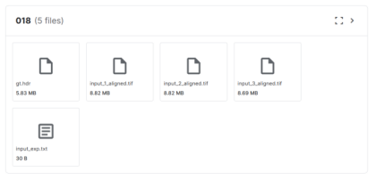

   测试样本显示如图：

   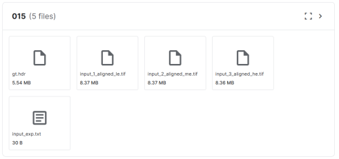


   每个样本包含三个低动态范围(LDR)图像，分别以{−2, 0, 2}或{−3, 0, 3}的曝光值捕获，以及一个相应的HDR ground truth图像。这些图像涵盖了各种场景，包括室内外、自然和人造环境等。

2.  **Sen数据集：**

    提供了多曝光的LDR图像，但没有提供对应的HDR ground truth图像。

3. **Tursun数据集：**

   与Sen数据集类似，Tursun数据集也提供了多曝光的LDR图像，但同样没有提供对应的HDR ground truth图像。

   ### **3.3.2 图像对齐**

   1\. 在数据集中，以\_align结尾的文件夹包含对齐的多重曝光图像。

   2\. 我们采用与 FSHDR 相同的对齐方法。对齐代码可以在 <https://github.com/Susmit-A/FSHDR/tree/master/matlab\\_liu\\_code> 中看到。

   ### **3.3.3 评估指标**

   使用 PSNR 和 SSIM作为评估指标。PSNR 和 SSIM 都是在线性域和色调映射域上计算的，分别表示为"-l"和"-u"。此外，采用 HDR-VDP-Ρ（Mantiuk 等人，2011）来测量结果和目标之间的人类视觉差异。 HDR-VDP-Ρ 越高，效果越好。

   ### **3.3.4 实施细节**

   **1. 源代码实现**

   ​	我们的实验在Kalantari17数据集上训练和测试，由于原始的Kalantari17数据集占内存很大，大约有60G，这里为了方便对模型进行训练调试，使用数据集中75个类别中的5类作为训练数据（19200张训练图像）。减少训练数据的后果是可能会导致模型过拟合于训练数据，使得测试结果分数较低。

   （1）加载训练集数据（5类）和测试集数据（10类）
   
   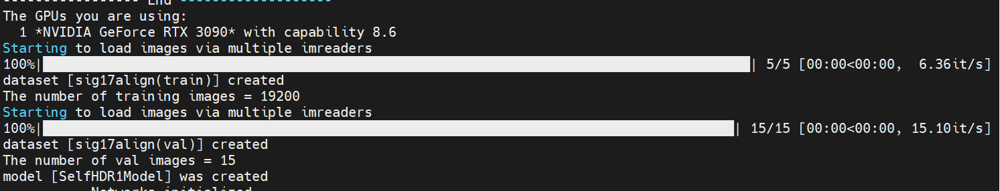
   
   （2）进行训练，训练过程显示为：
   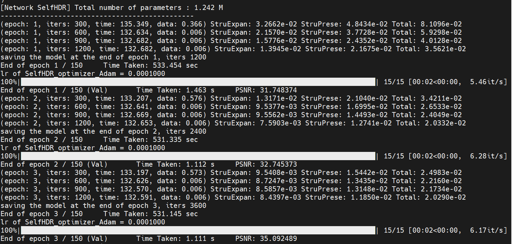
   
   ​	虽然只是使用了部分训练数据集，但可以看到每一轮训练都需要耗费大约6分钟的时间，原论文默认的训练轮数为150轮，那成功训练出一次模型就需要耗费15个小时。这样不方便调试，所以我们将其修改为先只训练10轮，这样做的后果可能导致模型参数没有充分收敛，看不出模型的实际效果如何。
   
   （3）则6-10轮训练结果显示如下：
   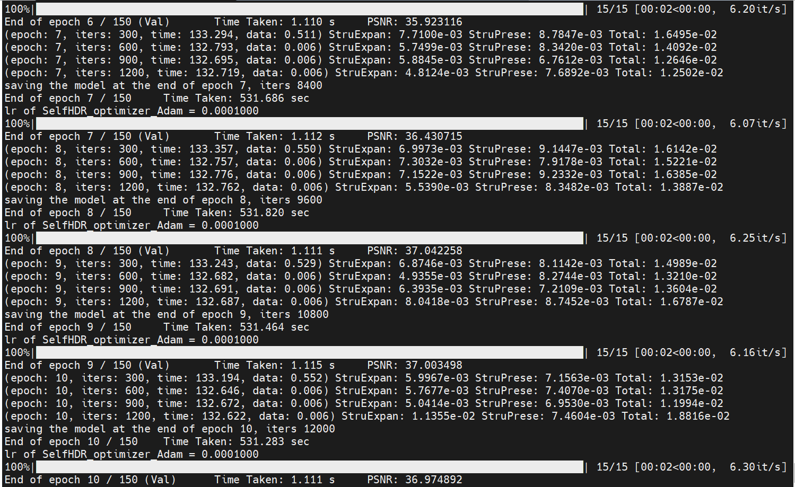
   
   2. **在图片对齐上尝试的改善：**
   
   ​	原论文提出使用光流估计来预对齐多曝光图像，然后利用预对齐的图像来预测HDR图像的颜色分量。其使用下式预测颜色成分，Ai代表像素级别的融合权重。
   
   
   （1）代码显示如下：
   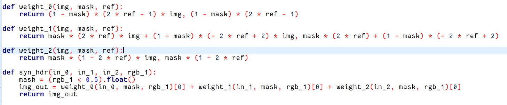
   
   ​	我们试图尝试改进权重Ai的计算方法，考虑更多的因素，如图像梯度、亮度差异等，以更准确地反映像素级的融合需求。但找到其权重函数位置后，发现研究算法的代码中并未使用到该函数，由此无法更改以进行进一步完善。
   
   3.  **优化器调整：**
   
   （1）原代码显示如下：
   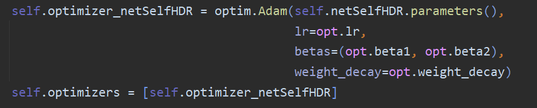
   
   ​	优化器是用于调整模型权重以最小化损失函数的关键组件，原论文采用的Adam优化器结合了Momentum和RMSprop的特点，虽然提供了良好的收敛性能，但不确定在该实验中对于大规模数据的效率是否为最优，则选择了进行优化器的修改，修改为SGD函数，SGD对于大规模数据集和复杂模型更合适。
   （2）则进行修改之后，显示结果如下：
   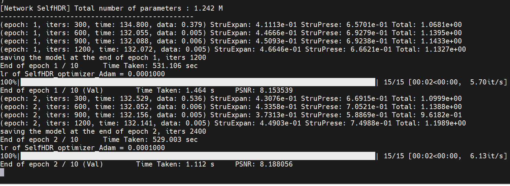
   
   ​	由于我们训练的数据仅仅只有五类，规模较小，显示结果远不比原代码训练的效果高，明显变差，由于内存受限，大规模数据无法验证，则对这一优化问题存有疑问。
   
   4. **损失函数的优化尝试：**
   
   （1）在原代码中，使用的损失函数是L1MuLoss，则代码显示如下：
   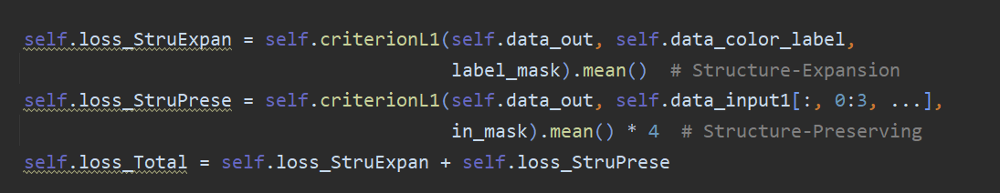
   
   ​	该代码中使用了两个不同的损失项，分别是self.loss\_StruExpan（结构扩展损失）和self.loss\_StruPrese（结构保持损失），它们通过不同的权重相加以形成总损失self.loss\_Total。确保这两个损失项的权重平衡。
   
   ​	则我们采取了尝试其他类型的损失函数，包括L2损失等，想要通过调整损失函数以找到最适合特定任务和数据集的损失函数。
   
   （2）则L2训练结果如下：
   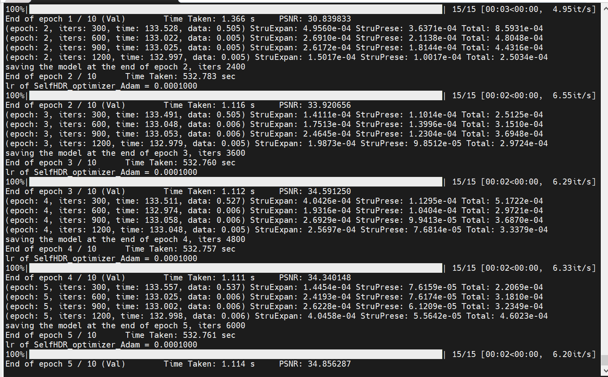
   
   事实证明，别的损失函数还是没有L1实现的模型性能高。
   
   5. **学习率考虑：**
      	在原代码中，学习率lr是通过命令行参数opt.lr传递给模型的，这意味着学习率是固定的，并且作者在训练开始时就通过命令行设置。但是，对于实际情况来说，保持学习率不变可能并不是最优的训练策略。为了提高训练效率和模型性能，我们尝试了进行学习率的修改。
      

​	（1）则尝试添加一个函数来计算当前的学习率。

```
def lr_scheduler(epoch, decay_steps, decay_rate):

    return decay_rate ** (epoch // decay_steps)
```

​	（2）更新学习率：

在self.optimizer\_netSelfHDR初始化时，使用学习率衰减函数来计算当前的学习率。

```
self.optimizer\_netSelfHDR \= optim.Adam(self.netSelfHDR.parameters(),

                                    lr\=lr\_scheduler(epoch,args.decay\_steps, args.decay\_rate),

                                    betas\=(args.beta1, args.beta2),

                                    weight\_decay\=args.weight\_decay)
```

​	（3）在优化过程中更新学习率：

在optimize\_parameters方法中，使用学习率衰减函数来更新学习率。

```
def optimize\_parameters(self, epoch):

     for param\_group in self.optimizer\_netSelfHDR.param\_groups:

         param\_group\['lr'] \= current\_lr

     self.optimizer\_netSelfHDR.zero\_grad()

     self.backward()

self.optimizer\_netSelfHDR.step()
```

​	则显示结果效果改变并不是很大，则针对该代码，这种尝试并没有显著提升效果。

# **4 结果 Results**

​	本次实验，我们阅读了发表在人工智能顶刊ICLR2024上的论文SELF-SUPERVISED HIGH DYNAMIC RANGE IMAGING WITH MULTI-EXPOSURE IMAGES IN DYNAMIC SCENES ，这是一种使用自监督形式进行HDR图像合成的方法，它创新性地提出了将输入信息提取为颜色和结构两个重要组件作为监督，有效地提升了现有的HDR方法的质量。我们阅读并理解此论文，并结合代码做出一系列优化性能的尝试，因原文的网络结构设计太过巧妙，以至于我们找不到可以修改和优化的地方，不过还是从优化器种类、学习率调整、图像对齐方法、损失函数修改等方向进行了探索。虽然最后的实验结果显示都不如原始的实验设置高，但是也加深了我们对于相关计算机视觉实验代码的熟悉程度，在此过程中也学习到了很多新的知识，受益匪浅。

# **5 总结和讨论 Discussion and conclusions**

## **5.1 总结**

​	本计算机视觉期末项目旨在探索自监督高动态范围（HDR）成像技术，特别是针对多重曝光图像的处理。我们参考了“SELF-SUPERVISED HIGH DYNAMIC RANGE IMAGING WITH MULTI-EXPOSURE IMAGES IN DYNAMIC SCENES”一文中的SelfHDR方法，并在其基础上进行了一些实验和优化。

​	我们的实验涉及了多个方面，包括使用不同的网络架构（AHDRNet、FSHDR、HDR-Transformer、SCTNet），数据集准备，模型训练，以及结果分析。我们主要采用了Kalantari等人的数据集，以及Sen和Tursun等人的数据集进行定性比较。

​	在实验过程中，我们尝试了多种方法来改进和优化模型，包括图像对齐方法的改进、优化器的调整、损失函数的优化以及学习率的考虑。虽然我们进行了多种尝试，但实验结果表明，原论文的代码效果最好。

## **5.2 讨论**

​	尽管我们的实验结果不理想，但我们通过这个项目获得了一些重要的收获和思考。

​	首先，我们深入了解了自监督HDR成像技术的原理和实现方法，这为我们未来的研究提供了基础。其次，我们通过尝试不同的方法，了解了这些方法的优势和局限性，这有助于我们更好地选择和设计未来的研究方法。

​	此外，我们还发现，在处理HDR图像重建问题时，深度学习方法提供了新的视角和解决方案。深度学习技术的应用是至关重要的，对于网络模型由于本文不考虑网络架构，所以并未尝试进行修改，以后也许可以尝试更改网络模型架构来提高性能，实现准确率的提高。

​	在实验过程中我们学习到了很多知识点包括各种损失函数的适用和更改等，在以后我们将继续探索和改进我们的方法，以实现更高效的操作。

# **6 分工及参考资料**

## **6.1 实验分工**

成员：孙延都 王茜

**孙延都：**

负责代码的运行和调试

负责模型训练和数据处理

负责函数的修改设计和实现

**王茜：**

负责数据集的准备和处理

负责学习率的函数调整编写

负责实验的实施和结果分析

**共同进行：**

负责整体实验的设计和规划

负责撰写实验报告

## **6.2 平台所用的工具和资源**

**实现平台：**

Python 3.x、PyTorch 1.12、MobaXterm

**第三方库：**

OpenCV、NumPy、Pillow、timm、tqdm、imageio、lpips、scikit-image、tensorboardX

**数据集：**

Kalantari等人的数据集

Sen和Tursun等人的数据集

**计算资源：**

部分训练数据集，内存限制

**其他相关资源：**

“SELF-SUPERVISED HIGH DYNAMIC RANGE IMAGING WITH MULTI-EXPOSURE IMAGES IN DYNAMIC SCENES”论文

FSHDR 论文和代码

HDR-Transformer 论文和代码

SCTNet 论文和代码

图像处理相关知识和技术
